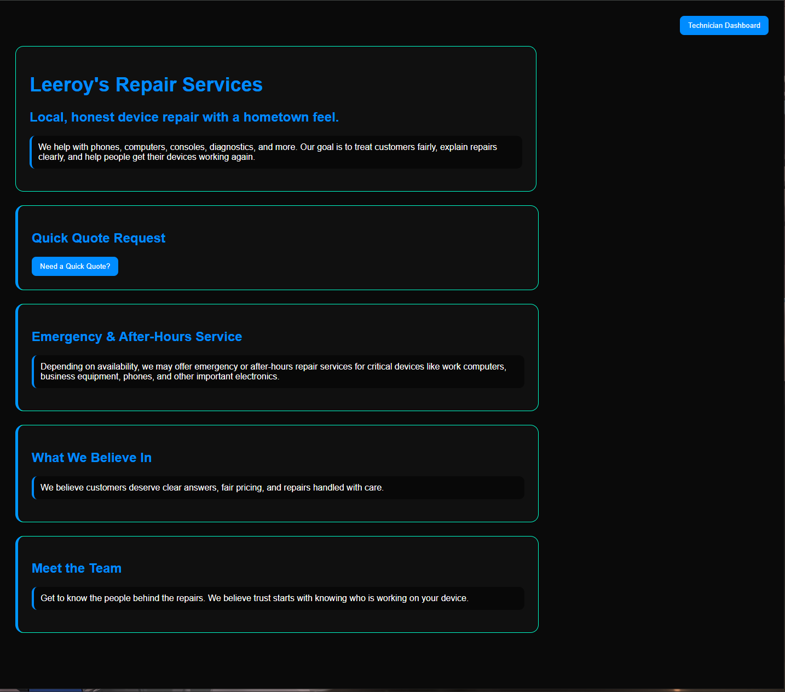
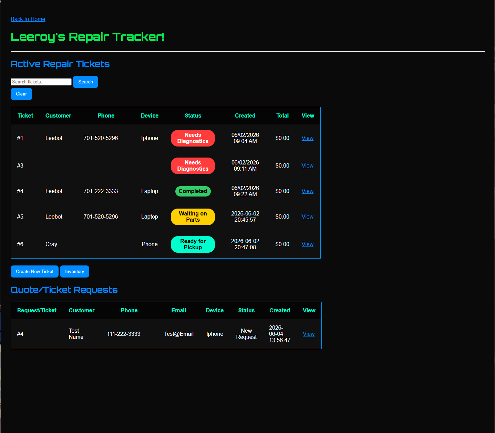
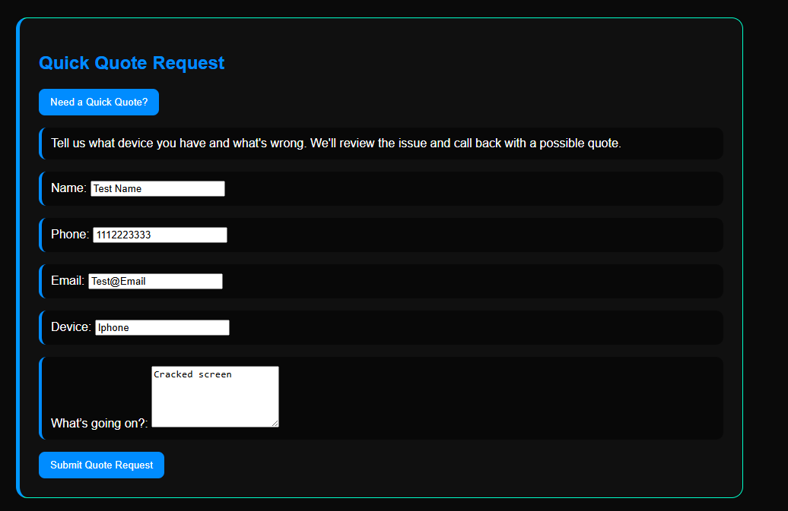
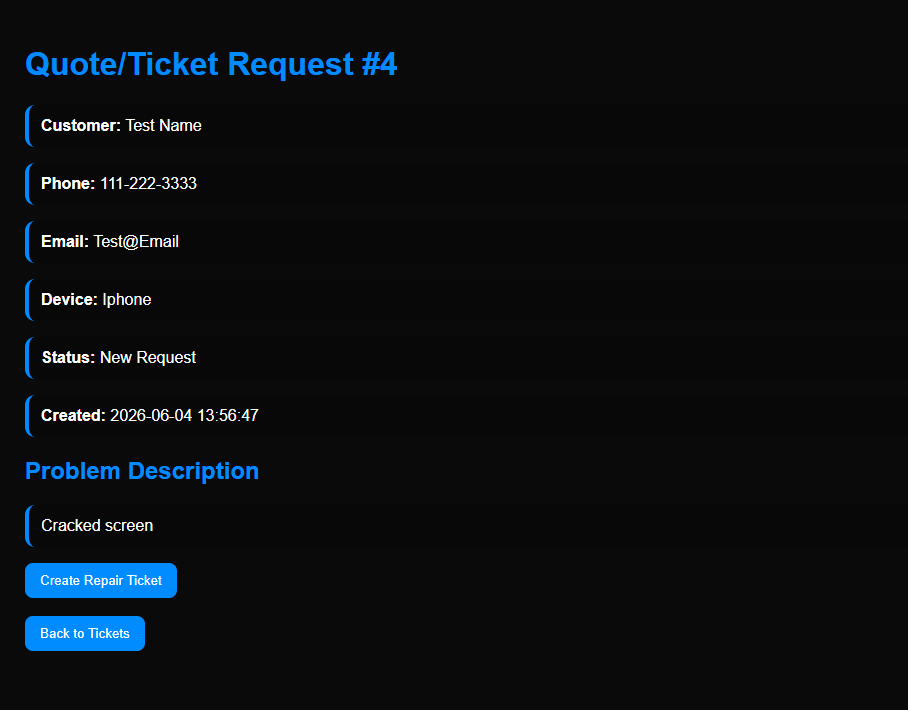
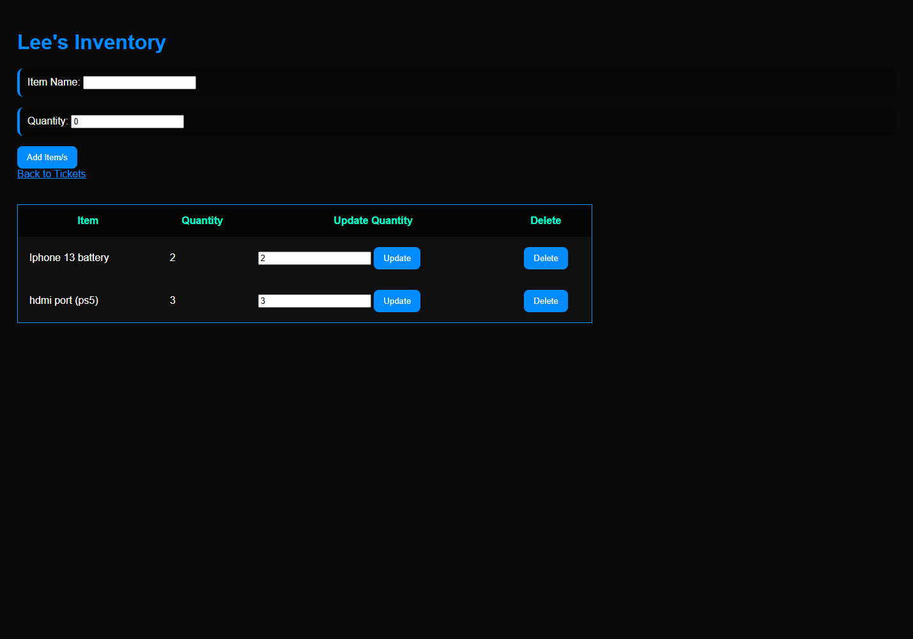

# Leeroy's Repair Tracker

A repair shop management web application built with Flask, SQLite, HTML, CSS, and JavaScript.

## Features

### Customer Features
- Submit quote requests
- Contact information collection
- Emergency repair information
- Customer-friendly homepage

### Technician Features
- Create repair tickets
- Edit repair tickets
- Search tickets
- Track repair status
- Track repair costs
- View quote requests
- Convert quote requests into repair tickets

### Inventory Management
- Add inventory items
- Edit inventory quantities
- Delete inventory items
- Track repair parts inventory

## Technologies Used

- Python
- Flask
- SQLite
- HTML
- CSS
- JavaScript
- Git
- GitHub

## Future Features

- Customer accounts
- Photo uploads
- Spanish language support
- Online payments
- Pickup and delivery requests
- Inventory usage tracking

## Screenshots

### Homepage

### Technician Dashboard

### Customer Quote Request

### Quote to Ticket Conversion

### Inventory Management

## Author

Leeroy S